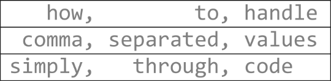

# [atet](https://github.com/atet) / [**_csv_**](https://github.com/atet/csv/blob/main/README.md#atet--csv)

[](#nolink)

This reference will show R and Python code to read, view, manipulate, transform, and save out comma-separated value (CSV) files. Though actions are largely similar, details and caveats regarding more advanced tabular file formats such as Excel Workbooks will not be covered here.

----------------------------------------------------------------------------

## Table of Contents

* [0. Requirements](#0-requirements)
* [1. Source Data](#1-source-data)
* [2. Read and Write File](#2-read-and-write-file)
* [3. Examine Contents](#3-examine-contents)
* [4. Subsetting](#4-subsetting)
* [5. Transforming](#5-transforming)
* [6. Merging](#6-merging)
* [7. Special](#7-special)

### Supplemental

* [Other Resources](#other-resources)
* [Troubleshooting](#troubleshooting)
* [References](#references)

----------------------------------------------------------------------------

## 0. Requirements

Only [R](https://www.r-project.org/about.html) and Python will be used in this reference. To quickly deploy either (or both, if you're adventurous!) of these programming languages and their development environments, I would suggest leveraging Docker.

Instructions to install Docker for Windows 10/11 can be found here: [https://github.com/atet/wsl](https://github.com/atet/wsl?tab=readme-ov-file#4-cli-docker)

After Docker is installed on your computer, click to expand the steps below to easily download and create the development environments:

<details>
<summary><a>R and RStudio</a></summary>

</br>

In your WSL terminal, download the `rocker/rstudio`<sup>1</sup> Docker image (~700 MB) and start the container:

```bash
$ docker pull rocker/rstudio:4.4.2
$ docker run -dit -p 8787:8787 --name rstudio -e PASSWORD=rstudio rocker/rstudio:4.4.2
```

In a web browser, visit http://localhost:8787 and log into RStudio using the username `rstudio` and password `rstudio`.

</details>
<details>
<summary><a>Python and Jupyter Notebook</a></summary>

</br>

In your WSL terminal, download the `jupyter/minimal-notebook`<sup>2</sup> Docker image (~450 MB) and start the container:

```bash
$ docker pull jupyter/minimal-notebook:x86_64-ubuntu-22.04
$ docker run -dit -p 8888:8888 --name jupyter -e JUPYTER_TOKEN=jupyter jupyter/minimal-notebook:x86_64-ubuntu-22.04
```

In a web browser, visit http://localhost:8888 and log into Jupyter using the token `jupyter`.

</details>

</br>

[Back to Top](#table-of-contents)

----------------------------------------------------------------------------

## 1. Source Data

We will be working with a simple comma-separated (CSV) file that could be downloaded directly from this GitHub repository into your programming environment ([here](https://raw.githubusercontent.com/atet/csv/refs/heads/main/dat/office.csv)) or simply copy/pasted into a new file called `office.csv`.

This file contains three rows (a.k.a. records) and three columns (a.k.a. fields) for a total of nine cells (not including column headers):

```bash
ID,FIRST NAME,QUOTE
2,Pam,"Just go after what you want and act fast, because life just isn't that long."
1,Pan,"There's a lot of beauty in ordinary things. Isn't that kind of the point?"
3,Jan,"There are always a million reasons not to do something."
```

Troubleshooting:
- Ensure that there are no spaces between delimiting commas as any "initial spaces" will cause issues with Microsoft Excel and Python Pandas reading the comma-separated value correctly.

[Back to Top](#table-of-contents)

----------------------------------------------------------------------------

## 2. Read and Write File

<table cellpadding="0" cellspacing="0" width="100%" border="0">
<tr>
<th>R</th>
<th>Python</th>
</tr>
<tr>
<td width="50%">

```r
# Read office.csv from GitHub as R data.frame object
df = read.csv(
    "https://raw.githubusercontent.com/atet/csv/refs/heads/main/dat/office.csv",
    check.names = FALSE,
    stringsAsFactors = FALSE
)

# View structure of the object
str(df)

# Save out object as office2.csv file to working directory
write.csv(df, "office2.csv", row.names = FALSE)

# View working directory where file was saved
getwd()


```

</td>
<td width="50%">

```python
# Install Pandas package and import packages
import os
os.system("pip install pandas")
import pandas as pd

# Read office.csv from GitHub as Pandas DataFrame object
df = pd.read_csv(
    "https://raw.githubusercontent.com/atet/csv/refs/heads/main/dat/office.csv"
)

# View structure of the object
df.dtypes

# Save out object as office2.csv file to working directory
df.to_csv("office2.csv", index=False)

# View working directory where file was saved
os.getcwd()
```

</td>
</tr>
</table>

[Back to Top](#table-of-contents)

----------------------------------------------------------------------------

## 3. Examine Contents

- Head/tail
- Metadata/structure
- Display all

[Back to Top](#table-of-contents)

----------------------------------------------------------------------------

## 4. Subsetting

- Indices
   - By row(s)
   - By column(s)
   - By row(s) and Column(s)
- Matching (R infix)

[Back to Top](#table-of-contents)

----------------------------------------------------------------------------

## 5. Transforming

- Summarize/pivot
- Split-apply-combine
- NOTE: R vectorization only applies to R numeric matrices

[Back to Top](#table-of-contents)

----------------------------------------------------------------------------

## 6. Merging

- Joins (left, inner, right, outer)

[Back to Top](#table-of-contents)

----------------------------------------------------------------------------

## 7. Special

- Dates

[Back to Top](#table-of-contents)

----------------------------------------------------------------------------
## Other Resources

**Description** | **URL Link**
--- | ---
null | null

[Back to Top](#table-of-contents)

----------------------------------------------------------------------------

## Troubleshooting

Issue | Solution
--- | ---
**"It's not working!"** | This concise tutorial has distilled hours of sweat, tears, and troubleshooting; _it can't not work_

[Back to Top](#table-of-contents)

----------------------------------------------------------------------------

## References

Citation | Description | Docker Hub Link
--- | --- | ---
**1** | R and RStudio Server Docker image from [Rocker Project](https://rocker-project.org/) | https://hub.docker.com/r/rocker/rstudio
**2** | Python and Jupyter Labs Docker image from [Jupyter Project](https://jupyter.org/) | https://hub.docker.com/r/jupyter/minimal-notebook

[Back to Top](#table-of-contents)

----------------------------------------------------------------------------

<p align="center">Copyright © 2025-∞ Athit Kao, <a href="http://www.athitkao.com/tos.html" target="_blank">Terms and Conditions</a></p>